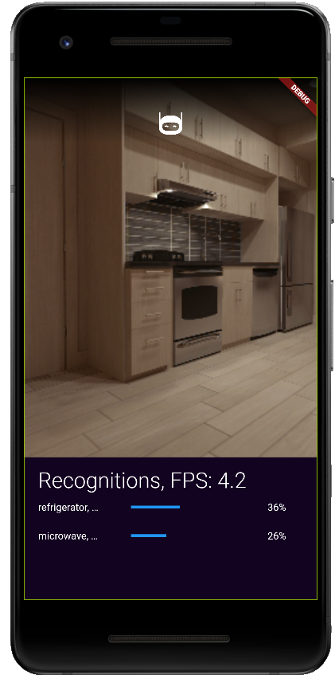

# melanom.ai
Mobile app for Android and iOS for real-time, automatic melanoma detection and classification using a mobile camera.

This was only a toy project for me to get to know Flutter. I did not finish the project, but as I managed to get the 
real-time image classifier working, I'm making the code public, as it could be of value to others.

Note that the continuous integration (CI; GitHub Actions) stuff never worked, but it should work fine if you build the app locally.

 

## Tricks
To run and test the app on a physical android device, see [here](https://developer.android.com/training/basics/firstapp/running-app).

## ToDo
* [x] Setup App development environment (ended up using Android Studio and Flutter for cross-platform dev)
* [x] Setup access to mobile camera
* [x] Get access to pretrained image classification model in tf-lite format
* [x] Setup app for running image classification on-the-fly when streaming images with the camera
* [x] Add FPS counter
* [x] Setup APK build
* [x] Build APK on the cloud using GitHub Actions (CI)
* [x] Test built APK (in debug mode) on new Android device (works!)
* [x] Try to improve inference speed (currently, FPS: ~ 4.8, using GPU twice as fast as CPU)
* [x] Add exponential smoothed running average
* [x] Bug: microphone seems to be needed in order to use the app
* [ ] Bug: memory leak - something fails to be destroyed for each image during inference
* [ ] Bug: app does not gracefully exit
* [ ] Add mole detection model/method
* [ ] Switch current MobileNetV1 model with melanoma classification model
* [ ] Bug: When "closing" app, it is only minimized, not properly closed (should have listener threads which handles exceptions when app is minimized)

## Credit
As I know fuck all about Flutter nor mobile app development, I have taken great inspiration from other open-source projects in the development of my app. These were:

* https://github.com/MCarlomagno/FlutterMobilenet
* https://github.com/kr1210/Flutter-Real-Time-Image-Classification
* https://github.com/jagrut-18/flutter_camera_app

